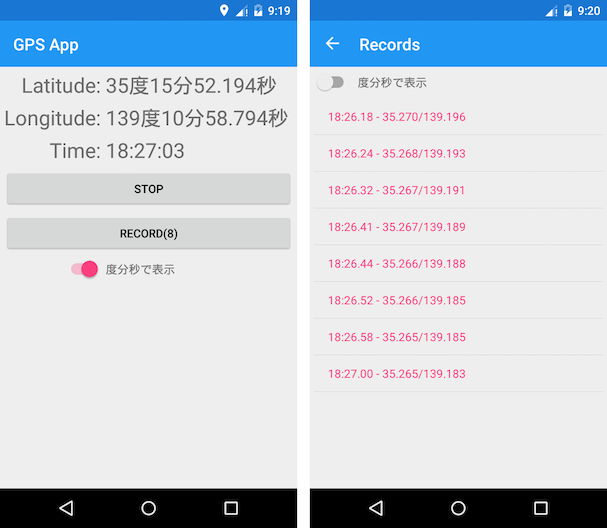

# 「Xamarin.Android で始めるクロスプラットモバイルアプリ開発」のサンプル「GPSアプリ」

## これは何？

これは [Xamarintans（ざまりたんず） が執筆した **「Essential Xamarin Yang (陽)」** ](https://atsushieno.github.io/xamaritans/tbf2.html)という技術同人誌の、
第1章「Xamarin.Android で始めるクロスプラットモバイルアプリ開発」 − 1.8節「Xamarinによる「クロスプラットフォーム」MVVM+Rxアプリケーション」 で登場する「GPSアプリケーション」を Android ネイティブと Xamarin(Xamarin.Forms) で実装したソースコードです。

書籍での解説の通り、Rx(RxJava や RxSwift) と MVVM、データバインディングを利用して開発されたモバイルアプリが、Xamarin(Xamarin.Forms) でどのように共通化できるかを示したリポジトリです。

## アプリの機能

* 端末のGPSから取得した位置情報を表示し続ける
* 緯度経度の表記を「度(34.5°)」と「度分秒(34度30分00秒)」で切り替える
* RECORDボタンを押した時点の緯度経度を記録する
* 記録した緯度経度群で最も位置精度の高いものを表示する
* 記録した緯度経度群を一覧で表示する

## ディレクトリ構成

### /GpsAppAndroid

Android ネイティブ(Java)で実装したプロジェクトです。Android Studio 2.2.3 で開発しています。

#### 主な使用技術
* Data Binding - Android Data Binding
* Rx - [RxJava 2.0](https://github.com/ReactiveX/RxJava)
* ViewModel - [RxProperty](https://github.com/k-kagurazaka/rx-property-android)
* Dependency Injection - [Dagger2](https://github.com/google/dagger)
* Others - [Lightweight-Stream-API](https://github.com/aNNiMON/Lightweight-Stream-API), [RetroLambda](https://github.com/evant/gradle-retrolambda)

### /GpsAppXamarinForms

Xamarin.Forms(C#)で実装したプロジェクトです。Visual Studio for Mac Preview 5 で開発しています。対応プラットフォームは Android
 と iOS です。

#### 主な使用技術
* Data Binding - Xamarin.Forms Data Binding
* Rx - [Reactive Extensions](https://github.com/Reactive-Extensions/Rx.NET)
* ViewModel - [ReactiveProperty](https://github.com/runceel/ReactiveProperty), [Prism for Xamarin.Forms](https://www.nuget.org/packages/Prism.Forms/)
* Dependency Injection - [Unity(Prism.Unity)](https://www.nuget.org/packages/Prism.Unity/)

## ブランチについて
master ブランチは、最新のソースコードを示しています。
書籍に対応するソースコードは、次のように書籍の版に対応した tag を付与しています。

* 2017年4月9日発行(Edition v1.0.0) - [v20170409](../../tree/v20170409)

## ライセンス
このリポジトリのライセンスは [LICENSE](LICENSE) に従います。
